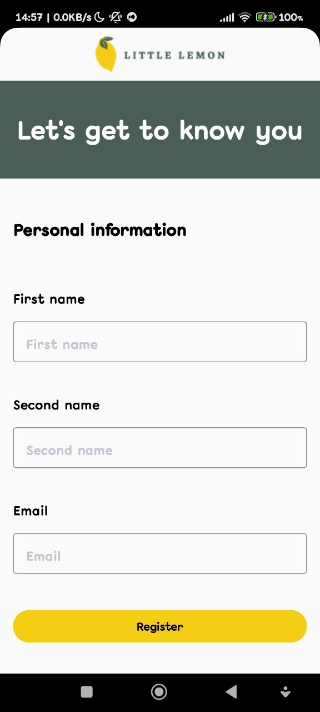
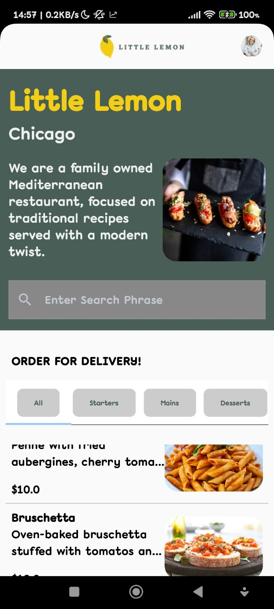
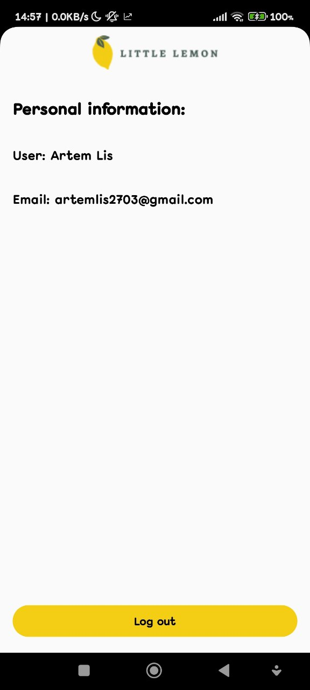

# LittleLemonApp
Little Lemon is app for ordering food.It was created in Kotlin.

# Features

- Users authentication using SharedPreferences
- Scrolling menu list
- Can searche and filter dishes
- Viewing profile screen

# Tools & Technology Used

- Android Studio & Kotlin
- Jetpack Compose
- Ktor for sending HTTP requests
- Room for interacting with the SqlLite database
- SharedPreference for managing user authentication
- Navigating with Compose

# Screenshots

